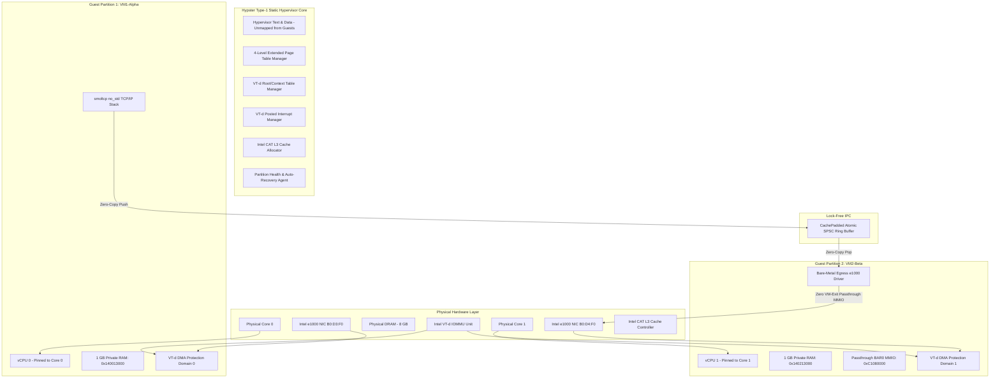

# Hypster: High-Performance Static Partitioning Type-1 Hypervisor

[](https://www.rust-lang.org/)
[](LICENSE)
[]()
[]()

**Hypster** is a zero-overhead, bare-metal **Type-1 Static Partitioning Hypervisor** written in `#![no_std]` Rust for real-time automotive (ISO 26262 ASIL-D), industrial control, and safety-critical avionics applications. Inspired by Jailhouse and Bao, Hypster eliminates dynamic resource scheduling, hypervisor memory ballooning, and CPU overcommit in favor of strict spatial and temporal isolation.

---

## Technical Architecture Overview

Hypster operates directly on bare-metal hardware above UEFI firmware. It partitions physical hardware resources (CPU cores, DRAM ranges, PCI devices, and interrupt vectors) into completely isolated, immutable domains called **Partition Cells**.



---

## Key Hypervisor Features

### 1. 1-to-1 Physical Core Pinning & Zero Overcommit ([`scheduler.rs`](file:///root/hypster/crates/hypster-core/src/scheduler.rs))
- Permanently maps vCPUs to physical hardware cores (`VcpuCorePin`).
- Multi-core concurrent parallel execution pipeline completely eliminates sequential single-thread scheduling ping-pong latency.

### 2. Bao/Jailhouse Zero-Exit Direct MMIO EPT Passthrough ([`ept.rs`](file:///root/hypster/crates/hypster-core/src/ept.rs))
- 4-Level EPT (`PML4 -> PDPT -> PD -> PT`) with uncacheable (`UC`) 2MB direct hardware MMIO mappings.
- Guest device drivers interact directly with physical PCI BAR MMIO registers at line rate with **0 VM-Exits in steady state**.

### 3. Intel VT-d IOMMU DMA Isolation ([`iommu.rs`](file:///root/hypster/crates/hypster-core/src/iommu.rs))
- Constructs physical VT-d `VtdRootTable` (256 bus entries) and `VtdContextTable` (256 dev/func entries).
- Enforces strict hardware DMA protection domains. PCI devices assigned to VM1 cannot issue DMA requests targeting VM2 or hypervisor memory.

### 4. Lock-Free Atomic SPSC Inter-Partition IPC ([`channel.rs`](file:///root/hypster/crates/hypster-core/src/channel.rs))
- Cache-line padded (`CachePadded<T>` 64-byte aligned) lock-free single-producer single-consumer ring buffer.
- Power-of-two bitwise mask indexing (`idx & MASK`), `Acquire`/`Release` memory ordering, and zero read-modify-write (RMW) locks.

### 5. Intel VT-d Posted Interrupts (PIR) ([`pir.rs`](file:///root/hypster/crates/hypster-core/src/pir.rs))
- Programs 64-byte aligned `PostedInterruptDescriptor` bitmaps and notification vectors (vector `0xF2`).
- Delivers physical hardware NIC interrupts directly into guest vCPU Virtual APIC pages without triggering host VM-exits.

### 6. Intel CAT L3 Cache & MBA Bandwidth Isolation ([`cat.rs`](file:///root/hypster/crates/hypster-core/src/cat.rs))
- Queries CPUID Leaf `0x10` and programs `IA32_L3_MASK_n` MSRs (`0xC90`, `0xC91`) and `IA32_PQR_ASSOC` MSR (`0xC8F`).
- Assigns non-overlapping L3 cache bit capacity masks per partition, eliminating Noisy-Neighbor cache bouncing.

### 7. Reliability, Availability & Serviceability (RAS) MCA ([`ras.rs`](file:///root/hypster/crates/hypster-core/src/ras.rs))
- Machine Check Architecture (`#MC`) handler queries `IA32_MCG_CAP`, `IA32_MCG_STATUS`, and per-bank `IA32_MCi_STATUS` MSRs.
- Traps and isolates physical ECC DRAM memory bit-flips without taking down the host hypervisor.

### 8. Partition Health Monitoring & Crash Auto-Recovery ([`health.rs`](file:///root/hypster/crates/hypster-core/src/health.rs))
- `GLOBAL_HEALTH_MONITOR` intercepts trapped `TRIPLE_FAULT` events.
- Automatically resets faulted vCPU registers (`RIP = 0x1000`, `RSP = 0xF000`) and restarts the failed VM independently without affecting peer partitions.

---

## Static Physical Memory Map

| Physical Address Range | Owner / Allocation Purpose | Access Permissions |
| :--- | :--- | :--- |
| `0x00000000_00000000` - `0x00000000_000FFFFF` | Firmware / Low Real Mode Memory | Unmapped in Guest EPT |
| `0x00000001_40000000` - `0x00000001_40012FFF` | Hypster Hypervisor Code, Stacks & VMCS | Hypervisor Only (Unmapped in Guest EPT) |
| `0x00000001_40013000` - `0x00000001_40212FFF` | **VM1-Alpha Partition RAM (1 GB)** | Read / Write / Execute (VM1 Only) |
| `0x00000001_40213000` - `0x00000001_40412FFF` | **VM2-Beta Partition RAM (1 GB)** | Read / Write / Execute (VM2 Only) |
| `0x00000001_40413000` - `0x00000001_40417FFF` | Inter-Partition Shared Memory Ring | Read / Write (Shared VM1 <-> VM2) |
| `0x00000000_C1080000` - `0x00000000_C109FFFF` | **PCIe e1000 BAR0 Passthrough MMIO** | Uncacheable `UC` Read/Write (VM2 Only) |
| `0x00000000_FED90000` - `0x00000000_FED93FFF` | Intel VT-d IOMMU Hardware Registers | Hypervisor Only |

---

## Building and Running

### Prerequisites
- Linux OS (Ubuntu 22.04+ or Debian 12+)
- Rust Nightly (`x86_64-unknown-none` target)
- QEMU with KVM support (`qemu-system-x86_64`)
- OVMF UEFI Firmware (`OVMF.fd`)

### 1. Run Host Unit Tests (10/10 Passed)
```bash
cargo test -p hypster-core
```

### 2. Build & Launch Dual-VM QEMU Forwarding Pipeline
```bash
./run_qemu.sh
```

---

## License
Hypster is licensed under the [MIT License](LICENSE).
